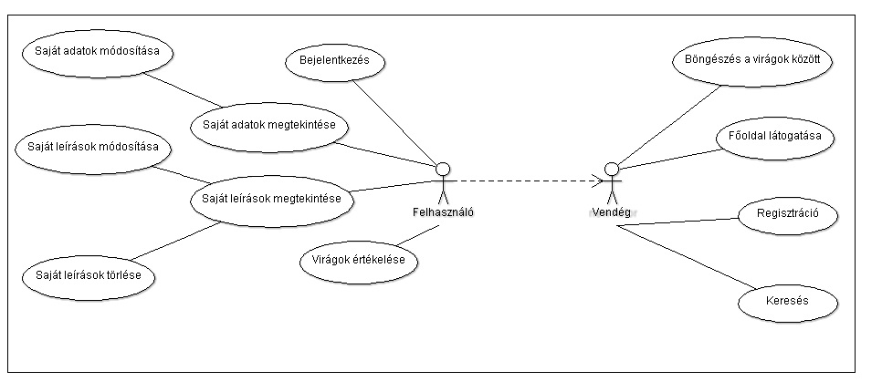
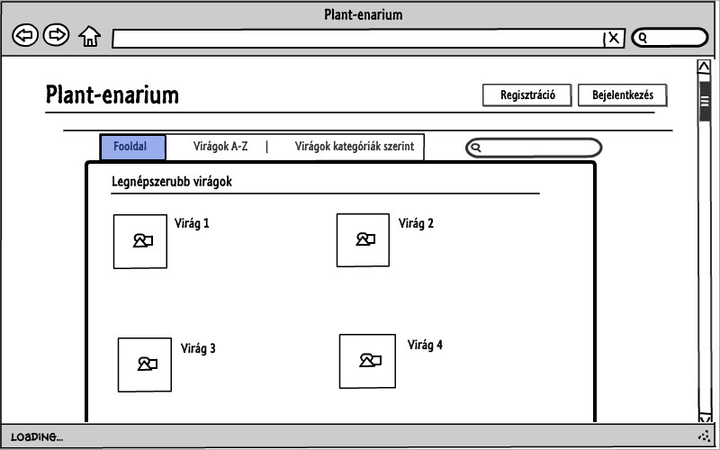
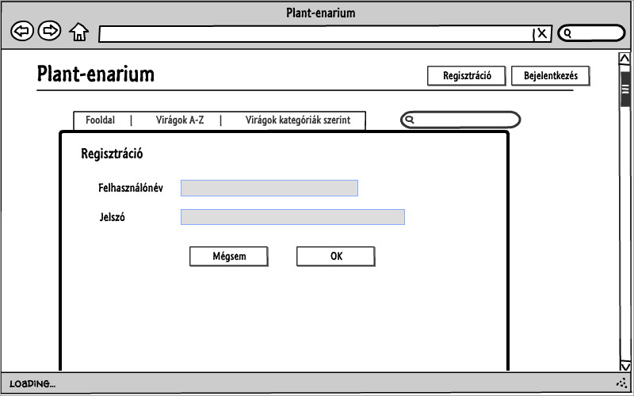
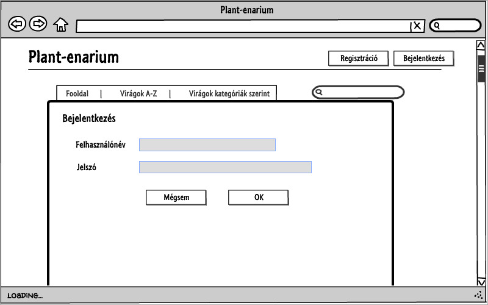
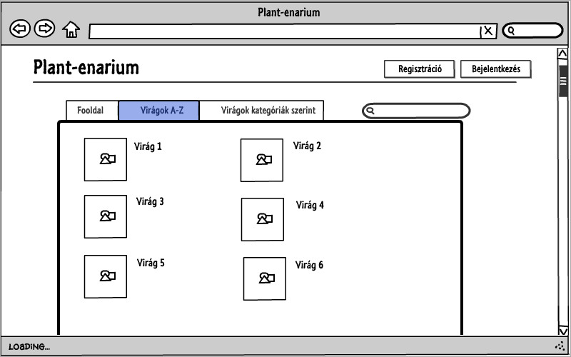
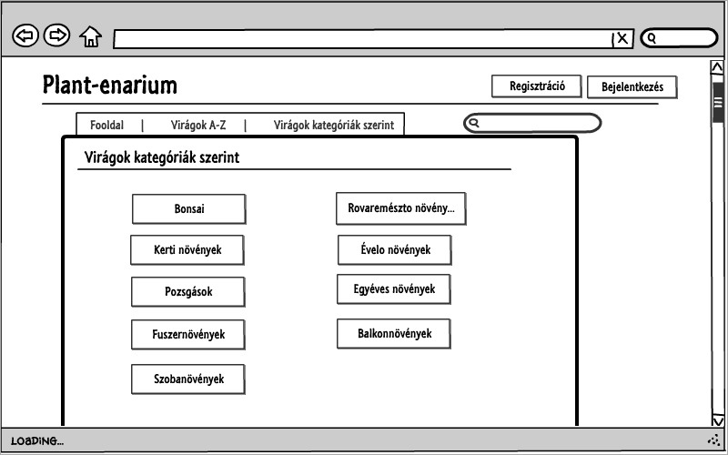
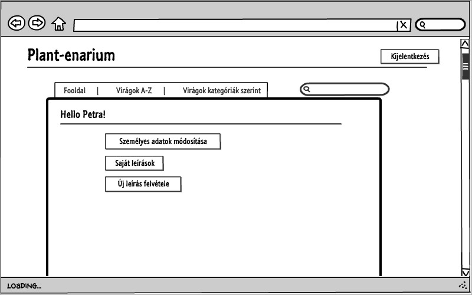
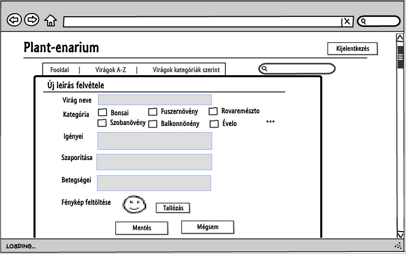
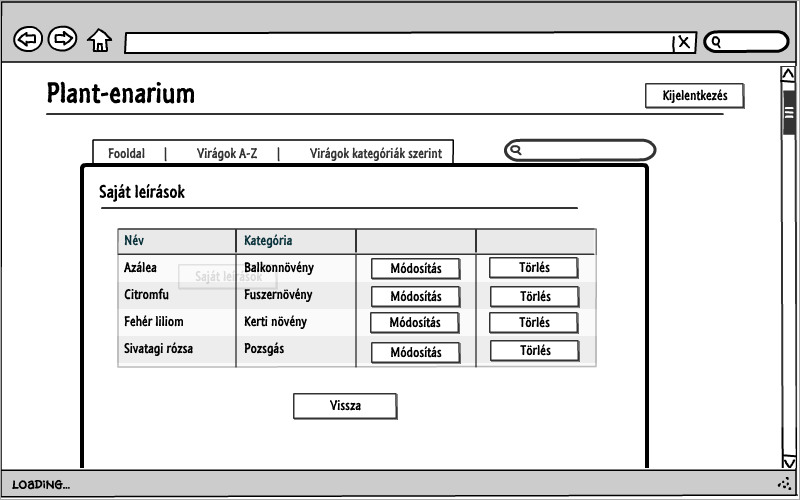

# Plant-enarium

Készítette: Hugyecz Petra

###Követelményanalízis
####Célkitűzés
A célom egy olyan oldal létrehozása, ami az egyes virágok gondozását, igényeit írja le. Vendégként csak nézni tudom az egyes leírásokat. Lehetőség lesz regisztrálni az oldalra. Bejelentkezés után tudok majd saját leírásokat is csinálni, és tudom értékelni az egyes virágokat.

#####Funkcionális követelmények
######Vendégként:
* főoldalon látni a legkedveltebb virágokat
* a virágok között szabadon böngészni
* megnézni az egyes virágok leírását
* virágot keresni 
* regisztrálni az oldalra

#####Felhasználóként:
* bejelentkezni az oldalra
* megtekinteni a személyes adataimat
* módosítani a személyes adataimat
* virágot értékelni
* virág leírást hozzáadni
* a saját leírásaimat törölni vagy módosítani
* kijelentkezni

#####Nem funkcionális követelmények
* gyors, biztonságos működés (jelszavak tárolása) 
* könnyű áttekintés (virágok ABC sorrendben és kategóriák szerint is)
* karbantarthatóság

#####Szakterületi fogalomjegyzék
* **Bonsai:** Lapos tálban nevelt fa. mMsterségesen, művészien alakított, formára metszett fa.
* **Rovaremésztő növények:** Köznapi nevén húsevő növények. Olyan növények, amelyek csupán tápanyagaik egy részét nyerik állati húsból, s nem az élethez szükséges kémiai energiát. Főként rovarokat és más ízeltlábúakat ejtenek csapdába. 
* **Évelő növények:** Azokat a lágyszárúakat szoktuk így nevezni, amik hosszú ideig élnek és termésérés után a föld feletti száruk elpusztul, viszont mindig van földbeli száruk (hagyma, gumó), vagy vastag gyökerük, ami áttelel.
* **Pozsgások:** Olyan növények, amelyek szárazságtűrőek, vagyis nem vízigényesek. Ide tartoznak a kaktuszok és sok sivatagi növény is. 
* **Egyéves növények:** Növények, melyek csíráznak, virágot hoznak és a termésérés után elpusztulnak, egy év időtartama alatt.
* **Balkonnövények:** Meghatározott mennyiségű földben, általában erkélyeken vagy teraszonok tartott egyéves növények.

##Használati esetek
####Használatieset-modell

####Oldalvázlatok

**Főoldal**

**Regisztráció**

**Bejelentkezés**

**Virág megtekintése**

**Virágok A-Z**

**Virágok kategóriák szerint**

**Saját profil**

**Új leírás felvétele**

**Saját leírások**

